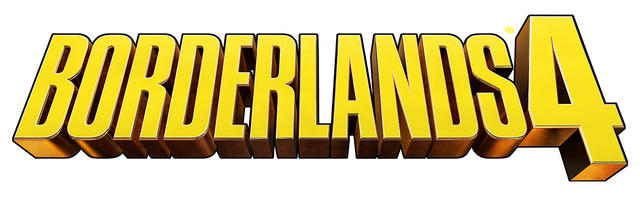

## Run Service
- Run [start-assets-server.bat](./start-assets-server.bat) file to start the project locally

 

## Helper Links

- Aspect Ratio Calculator: <a href="https://andrew.hedges.name/experiments/aspect_ratio/" target="_blank">Here</a>
  - Card image base Ratio: 160px $\times$ 219px
- **ResizePixel** image modifier: <a href="https://www.resizepixel.com/" target="_blank">Here</a>
- **ILoveImage** image cropper: <a href="https://www.iloveimg.com/crop-image" target="_blank">Here</a>
- Remove background: <a href="https://www.remove.bg/" target="_blank">Here</a>

 

## Games' Images Source

- <u>Characters:</u>
  - <u>PROFILE:</u> From <a href="https://www.hoyolab.com/accountCenter/postList?id=17195645" target="_blank">Hoyolab</a>, open GI page then download profile image from "All characters" page.
  - <u>CARD:</u> From <a href="https://genshin.hoyoverse.com/en/character/mondstadt" target="_blank">GI Official Page</a>, open & download character image
    - Crop images to: 964 $\times$ 1320
- <u>Weapons:</u> From <a href="https://www.hoyolab.com/accountCenter/postList?id=17195645" target="_blank">Hoyolab</a>, open GI page & download image from a character's details
- <u>Sets:</u> From <a href="https://www.hoyolab.com/accountCenter/postList?id=17195645" target="_blank">Hoyolab</a>, open GI page then open set wiki from a character's details & dowmload Flower piece image

---
 

- <u>Characters:</u>
  - <u>PROFILE:</u> From <a href="https://www.hoyolab.com/accountCenter/postList?id=17195645" target="_blank">Hoyolab</a>, open HSR page then download image from "Simplified" view
    - Crop images to: 160 $\times$ 160
  - <u>CARD:</u> From <a href="https://honkai-star-rail.fandom.com/wiki/Character/List" target="_blank">fandom wiki</a>, download "Portrait" image from character's page
    - Crop images to: 250 $\times$ 342 ~ 400 $\times$ 548 ~ 600 $\times$ 821
- <u>Weapons:</u> From <a href="https://www.hoyolab.com/accountCenter/postList?id=17195645" target="_blank">Hoyolab</a>, open HSR page & download image from a character's details
- <u>Sets:</u> From <a href="https://www.hoyolab.com/accountCenter/postList?id=17195645" target="_blank">Hoyolab</a>, open HSR page & download image of Head/Orb piece from a character's details

---
 

- <u>Characters:</u>
  - <u>PROFILE:</u> From <a href="https://wiki.hoyolab.com/pc/zzz/aggregate/8" target="_blank">HoYowiki</a>, open character's page then download image
    - Crop images to: 256 $\times$ 256 ~ 330 $\times$ 330
  - <u>CARD:</u> From <a href="https://wiki.hoyolab.com/pc/zzz/aggregate/8" target="_blank">HoYowiki</a>, open character's page then download image
    - Crop images to: 450 $\times$ 616 ~ 500 $\times$ 684
- <u>Weapons:</u> From <a href="https://www.hoyolab.com/accountCenter/postList?id=17195645" target="_blank">Hoyolab</a>, open ZZZ page & download image from a character's details
- <u>Sets:</u> From <a href="https://zenless-zone-zero.fandom.com/wiki/Drive_Disc/List" target="_blank">fandom wiki</a>, open & download image
  - Change parameter in url (50) to (256)
- <u>Bangboo:</u> From <a href="https://zenless-zone-zero.fandom.com/wiki/Bangboo" target="_blank">fandom wiki</a>, open & download image
  - Crop images to: 250 $\times$ 250

 

---
 

- <u>Characters:</u> From <a href="https://borderlands.2k.com/borderlands-4/game-info/#vault-hunters" target="_blank">BL4 Official Page</a>
- <u>Guns:</u> From <a href="https://www.lootlemon.com/grenade-mod/spinning-blade-bl4" target="_blank">here</a>
- <u>Equipment:</u> From <a href="https://www.lootlemon.com/grenade-mod/spinning-blade-bl4" target="_blank">here</a>
